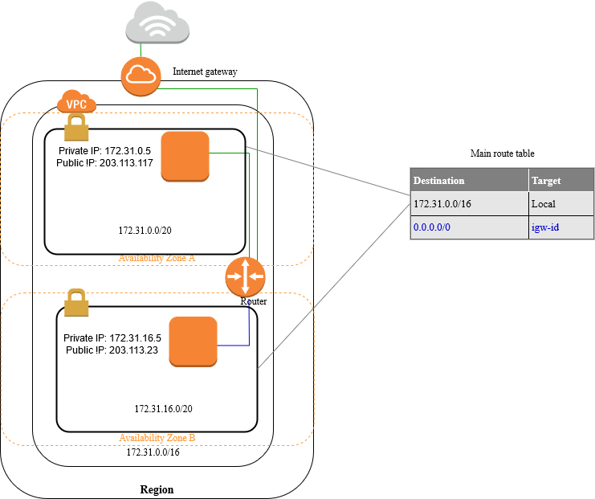
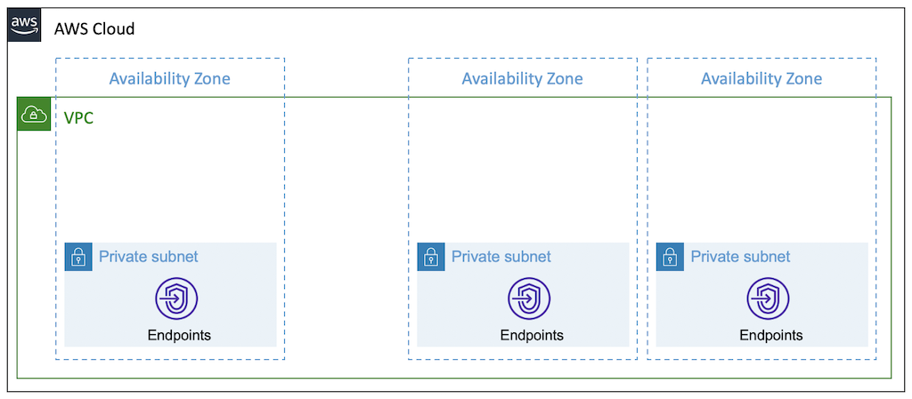
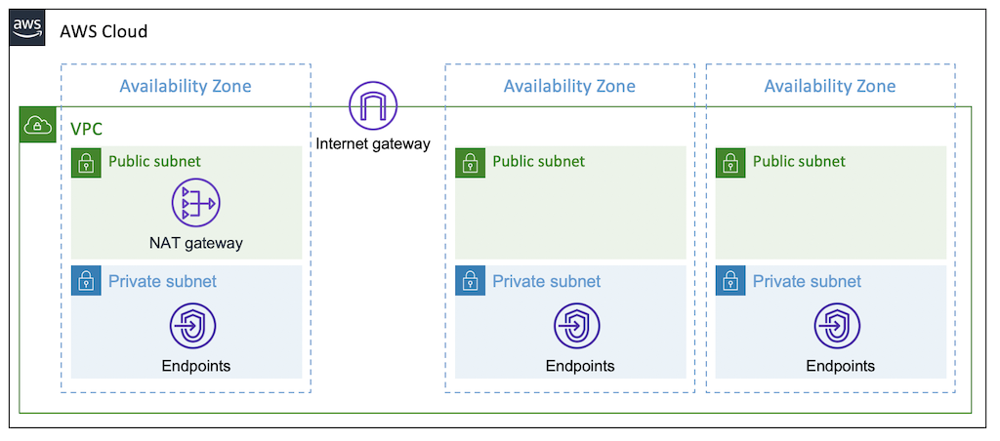
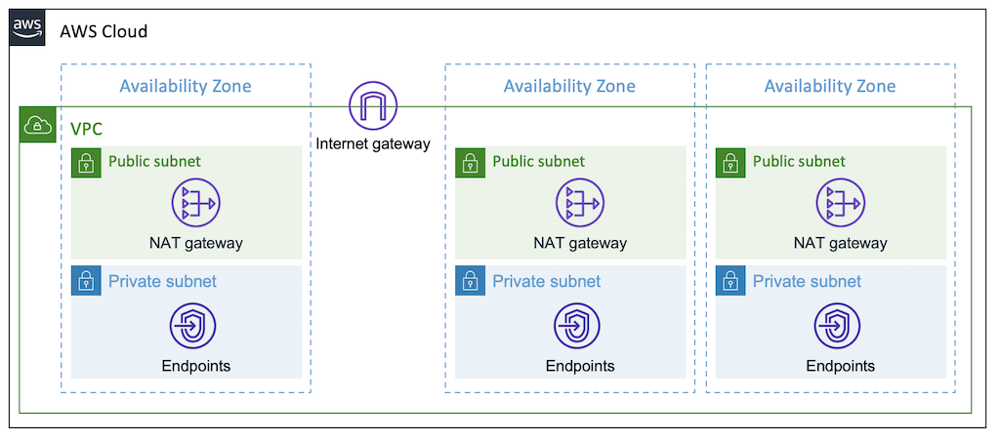

# Amazon VPC
[Amazon Virtual Private Cloud(Amazon VPC)](https://aws.amazon.com/vpc/) is a service that lets you launch AWS resources in a logically isolated virtual network that you define. You have complete control over your virtual networking environment, including selection of your own IP address range, creation of subnets, and configuration of route tables and network gateways. You can use both IPv4 and IPv6 for most resources in your virtual private cloud, helping to ensure secure and easy access to resources and applications.

## Examples
- [Amazon VPC](https://github.com/Young-ook/terraform-aws-vpc/blob/main/examples/vpc)
- [AWS Transit Gateway](https://github.com/Young-ook/terraform-aws-vpc/blob/main/examples/tgw)
- [VPC Peering](https://github.com/Young-ook/terraform-aws-vpc/blob/main/examples/peering)

## Getting started
### AWS CLI
Follow the official guide to install and configure profiles.
- [AWS CLI Installation](https://docs.aws.amazon.com/cli/latest/userguide/cli-chap-install.html)
- [AWS CLI Configuration](https://docs.aws.amazon.com/cli/latest/userguide/cli-configure-profiles.html)

### Terraform
Infrastructure Engineering team is using terraform to build and manage infrastucure for DevOps. And we have a plan to migrate cloudformation termplate to terraform.

To install Terraform, find the appropriate package (https://www.terraform.io/downloads.html) for your system and download it. Terraform is packaged as a zip archive and distributed as a single binary. Install Terraform by unzipping it and moving it to a directory included in your system's `PATH`. The [tfenv](https://github.com/tfutils/tfenv) is very useful solution.

And there is an another option for easy install.
```
brew install tfenv
```
You can use this utility to make it ease to install and switch terraform binaries in your workspace like below.
```
tfenv install 0.12.18
tfenv use 0.12.18
```
Also this tool is helpful to upgrade terraform v0.12. It is a major release focused on configuration language improvements and thus includes some changes that you'll need to consider when upgrading. But the version 0.11 and 0.12 are very different. So if some codes are written in older version and others are in 0.12 it would be great for us to have nice tool to support quick switching of version.
```
tfenv list
tfenv use 0.12.18
tfenv use 0.11.14
tfenv install latest
tfenv use 0.12.18
```

### Setup
```hcl
module "vpc" {
  source  = "Young-ook/vpc/aws"
  name    = "network"
  tags    = { env = "test" }
}
```
Run terraform:
```
terraform init
terraform apply
```

## Default VPC
A default VPC is ready for you to use so that you don't have to create and configure your own VPC. A default VPC is suitable for getting started quickly, and for launching public instances such as a blog or simple website. You can modify the components of your default VPC as needed.

The following figure illustrates the key components that we set up for a default VPC


## Default subnets
By default, a default subnet is a public subnet, because the main route table sends the subnet's traffic that is destined for the internet to the internet gateway. You can make a default subnet into a private subnet by removing the route from the destination 0.0.0.0/0 to the internet gateway. However, if you do this, no EC2 instance running in that subnet can access the internet.

What is *public* subnets? - public subnets connect directly to the Internet using an Internet Gateway. If you want your instances to have a public IP address and be directly reachable from the Internet, you must place them in a public subnet. In other word, *internet-facing* subnets.

## Custom VPC
To get started using Amazon VPC, you can create a non-default VPC. You can create a custom VPC for your workloads using this module. Following is a supported network architecture you can create with this vpc module.

### Network Architecture
#### Subnets
A VPC that is made from this module consists of different thress subnets that instances can be placed into. There is the description of three subnet types:

*Isolated* - isolated subnets do not route from or to the Internet, and as such do not require [NAT gateways](https://docs.aws.amazon.com/vpc/latest/userguide/vpc-nat-gateway.html). They can only connect to or be connected to from other instances in the same VPC.



*Private* - instances in private subnets are not directly routable from the Internet, and connect out to the Internet via a NAT gateway. Be aware that you will be charged for NAT gateways.

*Public* - public subnets connect directly to the Internet using an Internet Gateway. If you want your instances to have a public IP address and be directly reachable from the Internet, you must place them in a public subnet.


#### NAT(Network Address Translation) Gateway
The following diagram shows how to deploy a vpc with a single shared NAT gateway across the availability zones. This is a cost-effective method, but it has the weakness of causing communication problems when something goes wrong with the availability zone where the NAT gateway is located. This is good choice for development environments.



For high availability of communication between resources (instances) inside and outside your VPC, you should deploy a NAT gateway at least per Availability Zone. It is recommended to apply this configuration for production environments. By default, a NAT gateway is created in every public subnet for maximum availability.



# Known Issues
