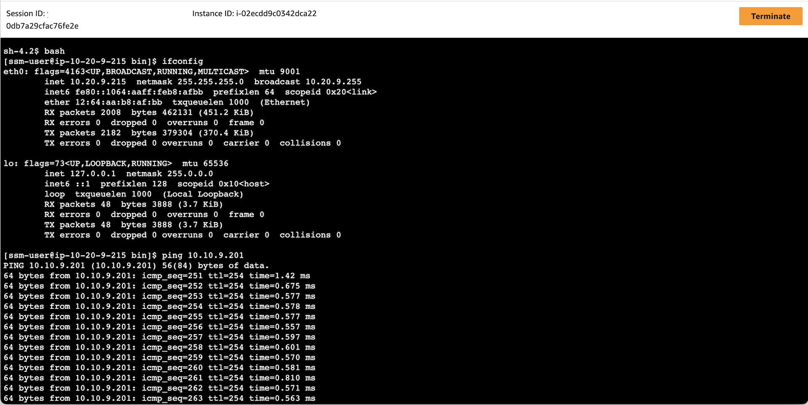

[[English](README.md)] [[한국어](README.ko.md)]

# VPC Blueprint
This is VPC Blueprint example helps you compose complete VPC, which is a isolated secure network on AWS. With this VPC Blueprint example, you describe the configuration for the desired state of your AWS global network, such as the Virtual Private Cloud (VPC), Transit Gateway (TGW), Peered VPCs, as an Infrastructure as Code (IaC) template/blueprint. Once a blueprint is configured, you can use it to stamp out consistent environments across multiple AWS accounts and Regions using your automation workflow tool, such as Jenkins, CodePipeline. VPC Blueprint also helps you implement relevant security controls needed to operate workloads from multiple teams in the pre-configured secure network.
Also, this VPC blueprint shows you how to establish a hybrid network ceonnection between an isolated network and a control plane network with TGW.

## Setup
## Download
Download this example on your workspace
```
git clone https://github.com/Young-ook/terraform-aws-vpc
cd terraform-aws-vpc/examples/blueprint
```

Then you are in **blueprint** directory under your current workspace. There is an exmaple that shows how to use terraform configurations to create and manage VPCs and VPC peerings on your AWS account. Please make sure that you have installed the terraform before moving to the next step.

First of all, you have to create two VPCs on your AWS account for hybrid connectivity simulation. One is an AWS VPC network and the other one is called 'corp' that simulates on-premises network.

Run terraform:
```
terraform init
terraform apply -target module.vpc -target module.corp
```
Also you can use the *-var-file* option for customized paramters when you run the terraform plan/apply command.
```
terraform plan -var-file fixture.tc1.tfvars
terraform apply -var-file fixture.tc1.tfvars
```

Then, you can then create a transit gateway (TGW) to connect the two VPCs. Once you're done applying terraforms, you can ping an EC2 instance on the 'corp' network to an EC2 instance running on the 'vpc' network with private IP.
```
terraform apply -target module.tgw -target module.vm
```

## Verify Transit Gateway (TGW) Connections
Move to the EC2 service page on the AWS Management Conosol and select Instances button on the left side menu. Find an instance that you launched. Select the instance and click *Connect* button on top of the window. After then you will see three tabs EC2 Instance Connect, Session Manager, SSH client. Select Session Manager tab and follow the instruction on the screen.



## Clean up
To destroy all infrastrcuture, run terraform:
```
terraform destroy
```

If you don't want to see a confirmation question, you can use quite option for terraform destroy command
```
terraform destroy --auto-approve
```

**[DON'T FORGET]** You have to use the *-var-file* option when you run terraform destroy command to delete the aws resources created with extra variable files.
```
terraform destroy -var-file fixture.tc1.tfvars
```

# Additional Resources
## Amazon VPC
- [EKS VPC routable IP address conservation patterns in a hybrid network](https://aws.amazon.com/blogs/containers/eks-vpc-routable-ip-address-conservation/)
- [One to Many: Evolving VPC Design](https://aws.amazon.com/blogs/architecture/one-to-many-evolving-vpc-design/)
- [Simplify network routing and security administration with VPC Prefix Lists](https://aws.amazon.com/blogs/networking-and-content-delivery/simplify-network-routing-and-security-administration-with-vpc-prefix-lists/)
- [Creating an AWS Client VPN with Terraform](https://timeular.com/blog/creating-an-aws-client-vpn-with-terraform/)
- [VPC sharing: key considerations and best practices](https://aws.amazon.com/blogs/networking-and-content-delivery/vpc-sharing-key-considerations-and-best-practices/)
- [Using VPC Sharing for a Cost-Effective Multi-Account Microservice Architecture](https://aws.amazon.com/blogs/architecture/using-vpc-sharing-for-a-cost-effective-multi-account-microservice-architecture/)
- [Control VPC sharing in an AWS multi-account setup with service control policies](https://aws.amazon.com/blogs/security/control-vpc-sharing-in-an-aws-multi-account-setup-with-service-control-policies/)
- [Introducing AWS Gateway Load Balancer – Easy Deployment, Scalability, and High Availability for Partner Appliances](https://aws.amazon.com/ko/blogs/aws/introducing-aws-gateway-load-balancer-easy-deployment-scalability-and-high-availability-for-partner-appliances/)
- [Integrate your custom logic or appliance with AWS Gateway Load Balancer](https://aws.amazon.com/ko/blogs/networking-and-content-delivery/integrate-your-custom-logic-or-appliance-with-aws-gateway-load-balancer/)
- [Finding and addressing Network Misconfigurations on AWS](https://validating-network-reachability.awssecworkshops.com/)
- [Analyze VPC Flow Logs with point-and-click Amazon Athena integration](https://aws.amazon.com/blogs/networking-and-content-delivery/analyze-vpc-flow-logs-with-point-and-click-amazon-athena-integration/)
- [Automating threat detection and response in AWS](https://d1.awsstatic.com/events/reinvent/2019/REPEAT_1_Automating_threat_detection_and_response_in_AWS_SEC301-R1.pdf)

## AWS Global Network
- [Leveraging AWS Global Backbone for Data Center Migration and Global Expansion](https://aws.amazon.com/blogs/architecture/leveraging-aws-global-backbone-for-data-center-migration-and-global-expansion/)
- [Setting up AWS Direct Connect gateway to route DX traffic to any AWS Region](https://aws.amazon.com/blogs/networking-and-content-delivery/setting-up-aws-direct-connect-gateway-to-route-dx-traffic-to-any-aws-region/)

## AWS Network Firewall
- [Deployment models for AWS Network Firewall](https://aws.amazon.com/blogs/networking-and-content-delivery/deployment-models-for-aws-network-firewall/)

## AWS Transit Gateway
- [Field Notes: Working with Route Tables in AWS Transit Gateway](https://aws.amazon.com/blogs/architecture/field-notes-working-with-route-tables-in-aws-transit-gateway/)
- [Scaling VPN throughput using AWS Transit Gateway](https://aws.amazon.com/blogs/networking-and-content-delivery/scaling-vpn-throughput-using-aws-transit-gateway/)
- [Integrating external multicast services with AWS](https://aws.amazon.com/blogs/networking-and-content-delivery/integrating-external-multicast-services-with-aws/)

## Data Transfer
- [Overview of Data Transfer Costs for Common Architectures](https://aws.amazon.com/blogs/architecture/overview-of-data-transfer-costs-for-common-architectures/)
